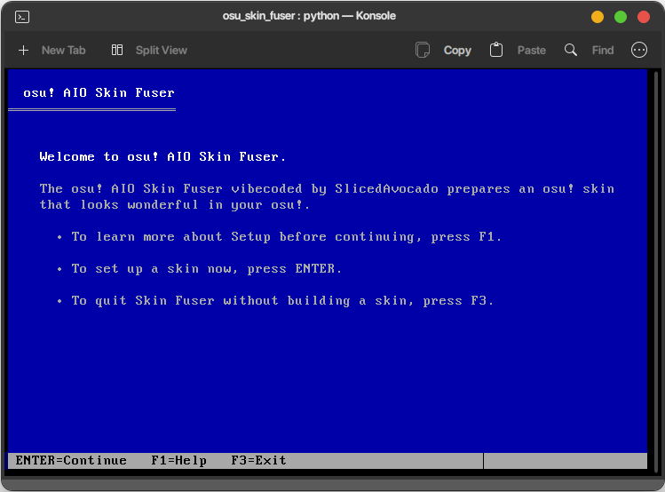
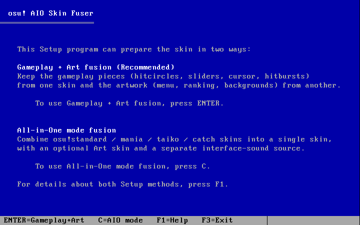
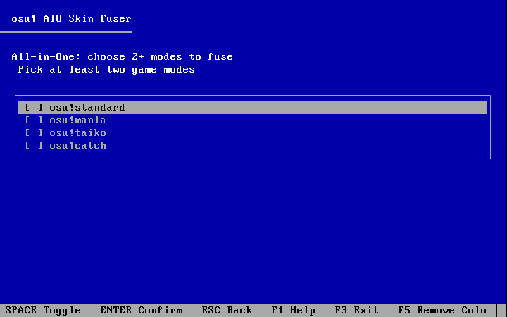
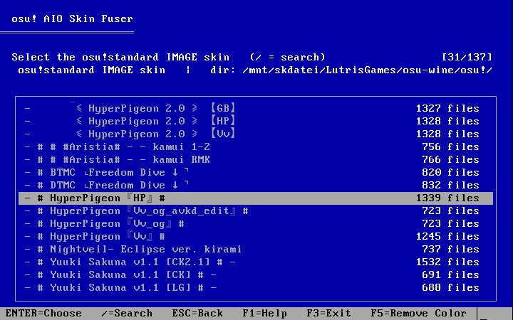
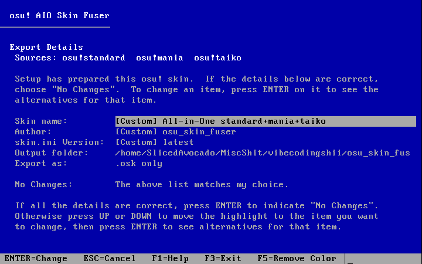
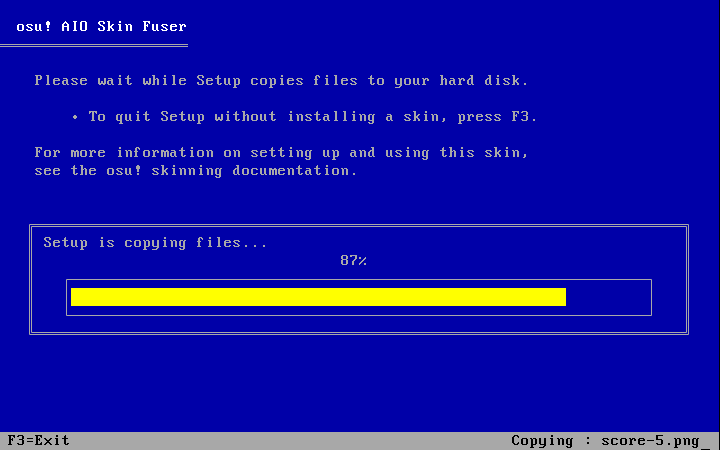

**English** | [繁體中文](README.zh-TW.md)

# Avocado-osu-Skin-Fuser

Everything down there including the script itself are written/translated by AI, this skin fuser is made purely for my own needs. but the retro Windows 3.1 setup UI looks so good.

I cannot provide any guarantees for this script, including security or anything else, but if anyone wants to use it, I hope you enjoy it! Its functionality is pretty basic, and there's definitely a lot of room for optimization in the steps, but I'm just too lazy .w.

Also it's currently only tested on Linux system, not sure if the directory works well on Windows.

A dependency-free terminal tool for building osu! skins out of *other* skins.

Give it two skins and it can keep the **gameplay** parts (hitcircles, sliders,
cursor, hitbursts…) from one skin while taking the **artwork** (menu, ranking
screen, backgrounds…) from another. Or go **All-in-One** and stitch
osu!standard / mania / taiko / catch skins into a single skin where each mode
plays like its own source.

It runs entirely in the terminal and dresses itself up like the classic
**Windows 3.1 Setup** program.



## Features

- **Two fusion modes**
  - *Gameplay + Art* — feel from one skin, looks from another.
  - *All-in-One* — combine 2+ game modes into one skin, optionally with a
    separate Art skin and a separate UI-sound source.
- **Per-element image fine-tuning** — choose which skin supplies each sprite,
  with a searchable list.
- **Per-sound fine-tuning** — hitsounds, mode sounds and interface/UI sounds are
  handled independently.
- **skin.ini control** — smart merge, take everything from one skin, or
  fine-tune every single key.
- **Export details** — set the skin's name / author / version (inherit from a
  source or type a custom value) and pick what gets written.
- **Searchable skin picker** — scan a folder once and the chosen directory is
  remembered for every later picker.
- **A TUI that looks like Windows Setup** — boxed lists, grey dialogs, a red
  quit-confirmation box, an inverted Help page and a copying-files progress bar.
- **CLI mode** — everything above is also scriptable for non-interactive use.

## Two ways to build a skin

On the second page, press **ENTER** for *Gameplay + Art* or **C** for
*All-in-One*.



### Gameplay + Art

- **Gameplay (feel)** supplies the hitcircles, sliders, spinner, cursor,
  hitbursts, hit numbers, etc.
- **Art (looks)** supplies the menu, ranking screen, backgrounds, buttons and
  the rest of the shared artwork.

You can override any individual element or sound afterwards.

### All-in-One

Combine at least two of osu!standard / mania / taiko / catch. Toggle the modes
with **SPACE**, confirm with **ENTER**.



For each selected mode you then pick a source skin (and, if you like, a separate
sound source per mode). Mode-specific resources come from that mode's skin,
shared gameplay hitsounds come from a base mode, and global menu / UI sounds
follow one interface source you choose — if that source doesn't contain a given
UI sound it is simply left out, so osu! falls back to its own default instead of
borrowing it from another skin.

## Picking source skins

The skin picker lists every skin it can find and shows how many files each one
has. Use **/** to search, or pick *"Enter your osu skin directory path…"* to
scan a folder — after that, every later picker stays in the same directory.



## Fine-tuning

After choosing sources you can fine-tune images, sounds and skin.ini:

- Each list shows every item together with the source it currently comes from.
- Press **ENTER** on a row to open a small dialog and pick a new source/value.
- Press **/** to search, **G** / **End** to jump to the last row.
- Every list ends with a **Done** row that finishes the list.

## Export details

The final page is laid out like the Windows Setup *System Information* screen.
Move with **UP/DOWN** and press **ENTER** on an item to change it.



You can set:

| Item | What it does |
| --- | --- |
| Skin name | The exported skin's name (inherit a source's name or type your own) |
| Author | The author written into `skin.ini` |
| skin.ini Version | The version string written into `skin.ini` |
| Output folder | Where the result is written |
| Export as | `.osk only` (default), `Folder only`, or `.osk + Folder` |

When everything looks right, move to **No Changes: The above list matches my
choice.** and press **ENTER** — Setup starts copying immediately.

## Exporting

The export runs inside the TUI as a Windows Setup *"Setup is copying files…"*
screen, with a progress bar and the file currently being copied shown in the
bottom-right corner. Press **F3** to abort.



When it finishes you get a summary page; press **ENTER** to quit or **R** to
build another skin without relaunching.

## Requirements

- **Python 3.8+**
- The **standard library only** — no `pip install` needed.
- A terminal with `curses`:
  - **Linux / macOS**: works out of the box.
  - **Windows**: `curses` isn't bundled, so run
    `pip install windows-curses` first (a proper 256-colour terminal such as
    Windows Terminal is recommended).

## Running

```bash
# from this folder
python3 osu_skin_fuser_3.20c.py

# (optional) give it the conventional name
mv osu_skin_fuser_3.20c.py osu_skin_fuser.py
python3 osu_skin_fuser.py
```

## Keyboard shortcuts

| Key | Action |
| --- | --- |
| `UP` / `DOWN` (or `K` / `J`) | Move the selection |
| `HOME` / `END` (or `G`) | Jump to the first / last item |
| `PAGE UP` / `PAGE DOWN` | Move ten items |
| `ENTER` | Activate the highlighted item |
| `SPACE` | Same as ENTER in settings lists; toggles items in multi-select |
| `/` | Search inside a list |
| `ESC` or `q` | Go back to the previous step |
| `F1` | Open the (inverted) Setup Help page |
| `F3` | Quit Setup — press `F3` again in the confirmation box to confirm |
| `F5` | Toggle colour / monochrome |

## Command line

Without `--gameplay`/`--art`/`--mode-skin` the interactive TUI starts. You can
also drive it non-interactively:

```bash
# two-skin fusion
python3 osu_skin_fuser.py --gameplay SkinA --art SkinB --name "My Mix" \
    --output ./FusedSkins

# All-in-One mode fusion
python3 osu_skin_fuser.py --all-in-one \
    --mode-skin standard=StdSkin --mode-skin mania=ManiaSkin \
    --mode-skin taiko=TaikoSkin --name "All-in-One"
```

Useful flags:

| Flag | Description |
| --- | --- |
| `--list` | List the skins found and exit |
| `--dry-run` | Print the plan without writing anything |
| `--output DIR` | Output folder (default `FusedSkins`) |
| `--export-mode {osk,folder,both}` | What to write (default `osk`) |
| `--image-source {mixed,gameplay,art}` | Where images come from |
| `--sounds {…}` | Sound preset |
| `--ini {smart,gameplay,art}` | skin.ini base |
| `--name` / `--author` / `--skin-version` | Override the export identity |

Run `python3 osu_skin_fuser.py --help` for the full list.

## How it works (roughly)

- Images are classified by their file names into *gameplay* pieces
  (`hitcircle*`, `slider*`, `cursor*`, …) and *artwork* (`menu-*`, `ranking-*`,
  backgrounds, …).
- Sounds are classified into hitsounds, mode-specific sounds and interface/UI
  sounds.
- `skin.ini` is merged as a union of every source's sections and keys
  (`[General]`, `[Colours]`, `[Fonts]`, `[Mania]`, `[CatchTheBeat]`), with a
  per-key source choice. A key that a chosen source doesn't provide is omitted
  so osu! uses its own default.

## Notes

This is an unofficial, fan-made tool and is not affiliated with osu! or
ppy. Always keep a backup of your skins — the tool writes new skins, it never
edits your sources in place.
